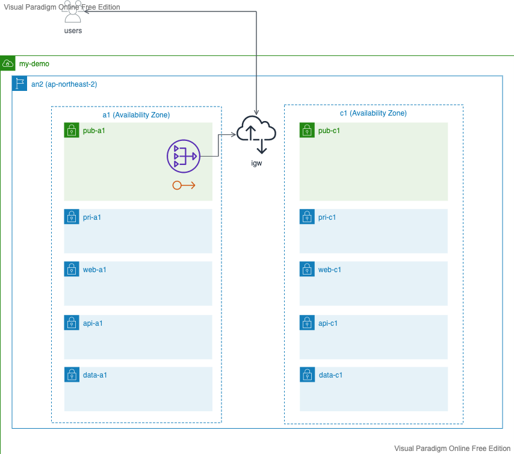
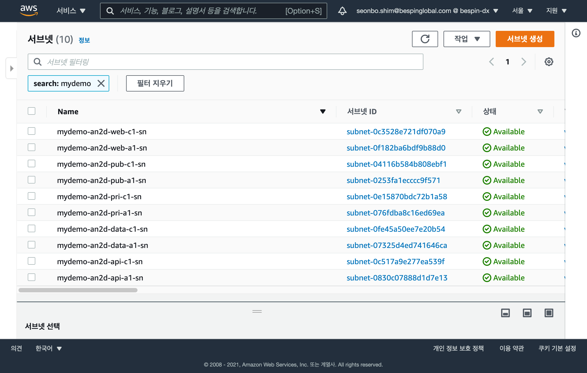

# EKS

AWS [EKS](https://docs.aws.amazon.com/eks/index.html) 서비스를 테라폼을 통해 자동화 구성 합니다.

## 주요 리소스

EKS 서비스를 구성하는 주요 리소스는 다음과 같습니다.



- 리소스 요약 참고

|  Service          | Resource             |  Description |
| :-------------:   | :-------------        | :----------- |
| EKS               | EKS Cluster           | EKS 클러스터 서비스를 구성 합니다. |   
| EKS               | EKS-OIDC              | EKS 클러스터 리소스와 AWS 클라우드 리소스들간의 액세스 체계인 IRSA(IAM Role for Service Account)를 위한 OIDC 서비스를 구성 합니다. |   
| EKS               | EKS NodeGroup         | 'WEB' 및 'API' 을 위한 관리형 EKS 워커 노드를 구성 합니다. |   
| IAM               | IAM Role              | EKS 관리를 위한 IAM Role 을 생성 합니다. |   
| IAM               | IAM Policy            | EKS 관리를 위한 IAM Policy 를 을 생성 합니다.|   
| EC2               | SecurityGroup         | EKS 관리 및 액세스를 위한 클러스터 보안 그룹과 워커 노드를 위한 보안 그룹을 생성 합니다. |

## Amazon EKS 클러스터 IAM 역할
Amazon EKS 에서 관리하는 Kubernetes 클러스터는 사용자 대신 다른 AWS 서비스를 호출하여 서비스에 사용하는 리소스를 관리합니다. 
Amazon EKS 클러스터를 생성하려면 먼저 IAM 정책을 사용하여 IAM 역할을 만들어야 합니다.

- **ClusterRole**는, EKS 내부에서 클러스터 관리를 위한 IAM Role 및 주요 Policies 입니다.

|  Policy Name     | Mandatory |  Description |
| :-------------   | :--------: | :----------- |
| AmazonEKSClusterPolicy  | Yes | Kubernetes가 사용자를 대신하여 리소스를 관리하는 데 필요한 권한을 제공합니다. Kubernetes는 인스턴스, 보안 그룹 및 탄력적 네트워크 인터페이스를 포함하며 EC2 리소스에 대한 배치를 위해 Ec2:CreateTags 권한도 부여 됩니다. |   
| AmazonEKSServicePolicy  | Yes | EKS 클러스터를 운영하는 데 필요한 Kubernetes용 리소스를 생성 및 관리할 수 있습니다. |
| AmazonEKSVPCResourceController | Yes  | EKS 워커 노드의 ENI 및 IP를 관리하기 위해 VPC 리소스 컨트롤러에서 사용하는 정책입니다.|
| EKSDenyLogGroupPolicy   | Yes |  EKS 클러스터에 대해 별도의 LogGroup 생성을 거부하는 권한 정책을 부여 합니다. |
| ELBServiceLinkPolicy    | No | EKS 가 ELB 와의 서비스 연결 역할을 생성할 수 있는 권한을 생성 합니다. |


- **WorkerEC2Role**는, EKS 내부에서 클러스터의 워커노드 관리를 위한 IAM Role 및 주요 Policies 입니다. 

|  Policy Name      | Mandatory |  Description |
| :-------------    | :-------: | :----------- |
| AmazonEKSWorkerNodePolicy           | Yes | Amazon EKS 워커 노드가 클러스터에 연결할 수 있는 권한을 부여 합니다. |   
| AmazonEKS_CNI_Policy                | Yes | Amazon EKS 클러스터의 포드 네트워킹을 위한 Kubernetes용 Amazon VPC CNI 네트워크 플러그인 생성 권한을 부여 합니다. 플러그인은 Kubernetes 노드에 VPC IP 주소를 할당하고 각 노드의 포드에 필요한 네트워킹을 구성하는 역할을 합니다. |
| AmazonEC2ContainerRegistryReadOnly  | Yes | Amazon EC2 Container Registry 리포지토리에 대한 읽기 액세스 권한을 부여 합니다.|
| AmazonS3FullAccess    | No | Amazon EKS 워커 노드가 S3 를 액세스 할 수 있는 권한을 부여 합니다. (ML / BigData 처리 등)  |
| AmazonEC2RoleforSSM   | No | Amazon EKS 워커 노드가 SSM(Systems Manager) 관리형 EC2 로 관리되도록 권한을 부여 합니다. |


- **EKSAdminRole** EKS 클러스터를 관리하기 위해 별도 어드민용 IAM Role 및 주요 Policies 입니다.

|  Policy Name      | Mandatory |  Description |
| :-------------    | :-------: | :----------- |
| MFAForcedPolicy       | Yes | Amazon EKS 를 접근하는 사용자에게 MFA 디바이스를 활성화 하도록 강제 합니다. |
| AssumeRoleAdminPolicy | Yes | Amazon EKS 를 접근하는 사용자에게 Admin AssumeRole 권한을 부여 합니다. |   


- **EKSViewerRole** EKS 클러스터를 관리하기 위한 별도의 Read-Only 용 IAM Role 및 주요 Policies 입니다.

|  Policy Name      | Mandatory |  Description |
| :-------------:   | :-------: | :----------- |
| MFAForcedPolicy         | Yes | Amazon EKS 를 접근하는 사용자에게 MFA 디바이스를 활성화 하도록 강제 합니다. |
| AssumeRoleViewerPolicy  | Yes | Amazon EKS 를 접근하는 사용자에게 EKS 자원들에 대해 읽기 전용 AssumeRole 권한을 부여 합니다. |   

- [Amazon EKS 클러스터 IAM 역할](https://docs.aws.amazon.com/ko_kr/eks/latest/userguide/service_IAM_role.html) 참조


## Build
Terraform 을 통해 AWS 클라우드에 EKS 서비스를 생성(Provisioning) 합니다.  
EKS 서비스를 생성 하려면 VPC 서비스가 사전에 구성 되어 있어야 합니다. 만약 구성되지 않았다면, [10-vpc](../10-vpc/README.md) 를 통해 VPC 를 먼저 생성 하세요  

```shell
git clone https://github.com/bsp-dx/eks-apps-handson.git
cd eks-apps-handson/20-eks

terraform init
terraform plan
terraform apply
```

## Check

AWS 관리 콘솔 또는 AWS CLI 를 통해 구성된 리소스를 확인 할 수 있습니다.

```
# VPC 확인 
aws ec2 describe-vpcs --filters 'Name=tag:Name,Values=mydemo*'

# Subnets 확인 (pub, pri, web, api, data 에 대해 각각 2개의 az 으로 구성되므로 총 10개의 subnet 이 확인 됩니다.)  
aws ec2 describe-subnets --filters 'Name=tag:Name,Values=mydemo*' --query 'Subnets[].Tags[?Key==`Name`].Value[]' --output=table
```

- AWS 관리 콘솔을 통해 확인
  

## Terraform VPC 모듈의 이해

'tfmodule-aws-vpc' 표준화된 모듈을 통해 VPC 를 구현 합니다.

- VPC 모듈의 정의

테라폼 모듈은 module "{모듈 이름}" 블럭으로 정의 합니다.

아래 코드는 "vpc" 라는 테라폼 모듈을 정의 하는 예시 입니다.

```
module "vpc" {

  /* 테라폼 자동화 모듈인 'tfmodule-aws-vpc' 을 참조 합니다. */
  source = "../module/tfmodule-aws-vpc/"
  
  /* DxBuiler 를 통한 표준화된 클라우드 정책 중 Resource 네이밍 정책과 Tags 속성 정책이 context 정보를 기준으로 설정 됩니다. */
  context = var.context

  ...
}
```

## EKS  모듈의 주요 입력 변수
 
## EKS 모듈의 사용 예시

- VPC 의 CIDR 블럭을 "172.100.0.0/16" 으로 정의 
- 서울 리전 대상으로 고 가용성을 위해 availability zone 을 3개("apne2-az1, apne2-az2, apne2-az3") 로 정의 
- public 서브넷을 pub-a1, pub-b1, pub-c1 으로 정의 하고 CIDR 을 172.100.[1-3].0/24 으로 정의 
- private 서브넷을 internal-a1, internal-b1, internal-c1 으로 정의 하고 CIDR 을 172.100.[31-33].0/24 으로 정의

만약 고객이 위와 같은 VPC 서비스를 구성해 달라는 요청을 한다면 아래와 같이 쉽게 구성을 할 수 있습니다.

```
module "ctx" {
  source = "../context"
}

module "eks" {
  source                      = "../module/tfmodule-aws-eks"

  context                       = module.ctx.context
  
  cluster_version               = "1.21"

  vpc_id                        = data.aws_vpc.this.id
  subnets                       = data.aws_subnet_ids.subnets.ids

  map_users = [
    {
      userarn  = "arn:aws:iam::827519537363:user/seonbo.shim@bespinglobal.com"
      username = "seonbo.shim@bespinglobal.com"
      groups   = ["system:masters"]
    },
  ]

  node_groups_defaults = {
    ami_type  = "AL2_x86_64"
    disk_size = 50
  }

  node_groups = {
    web = {
      instance_types   = ["m5.large"]
      additional_tags  = { Name = "${local.cluster_name}-web" }
      k8s_labels       = { eks-nodegroup = "web"}
      iam_role_arn     = module.eks.worker_iam_role_arn
      desired_capacity = 1
      min_capacity     = 1
      max_capacity     = 10
      subnets          = data.aws_subnet_ids.web.ids
    }

    api = {
      instance_types   = ["m5.large"]
      additional_tags  = { Name = "${local.cluster_name}-api" }
      k8s_labels       = { eks-nodegroup = "api"}
      iam_role_arn     = module.eks.worker_iam_role_arn
      desired_capacity = 1
      min_capacity     = 1
      max_capacity     = 10
      subnets          = data.aws_subnet_ids.api.ids
    }
  }

  depends_on = [ module.ctx ]

}

```