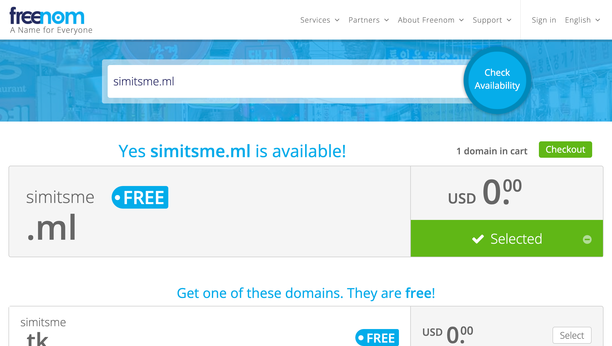
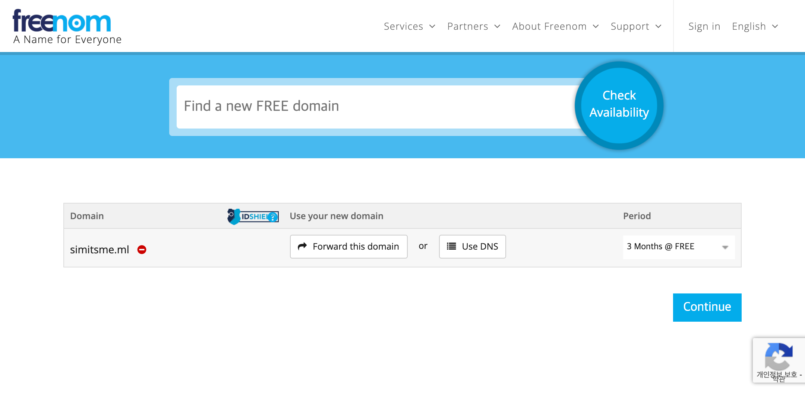
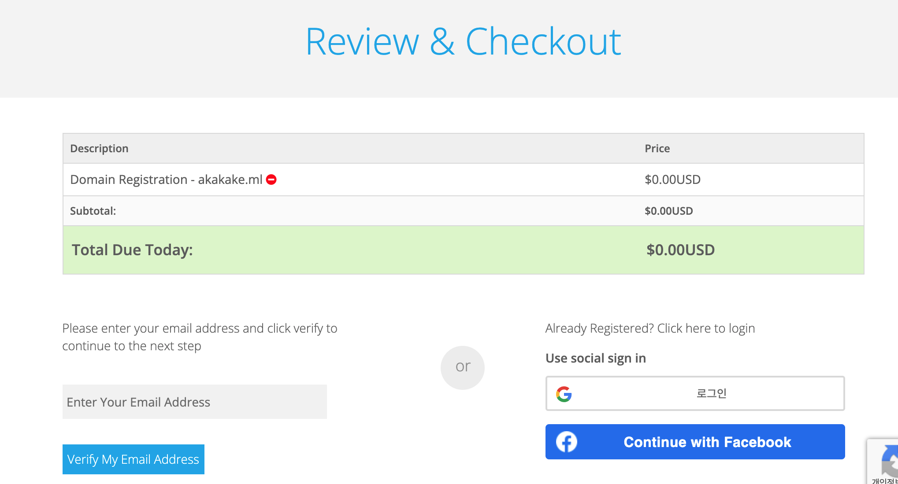
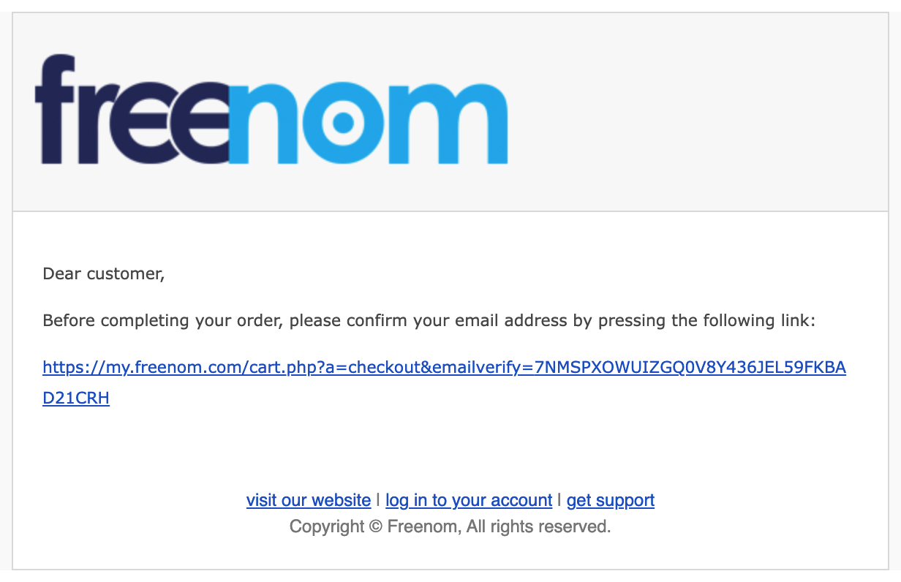
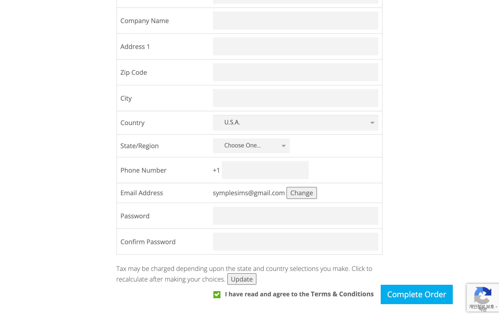
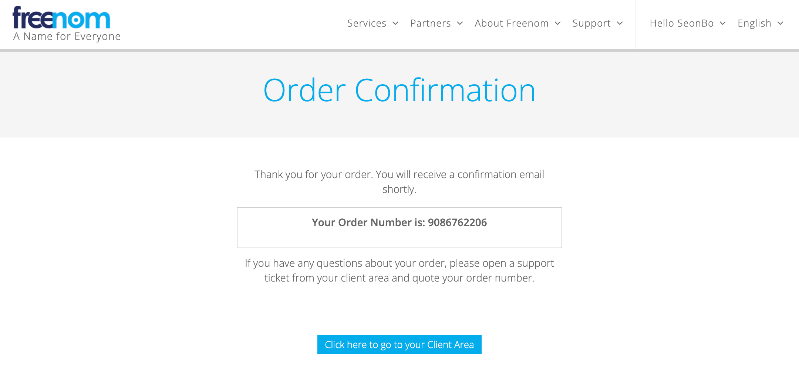

# freenom 무료 도메인 등록
AWS 클라우드를 통해 인터넷 서비스로 제공 하려면 신뢰 할 수 있는 공인된 인증서(AWS ACM)가 설정된 Public 도메인이 필요 합니다.  
도메인 발급은 별도의 비용이 발생 하기에 공부를 목적으로 한시적으로 이용할 수 있는 [freenom.com](https://freenom.com) 을 통해 발급 합시다.

## 무료 도메인 검색
[freenom.com](https://freenom.com) 사이트에 방문 하여 원하는 도메인을 입력 합니다.

1. 이용 가능한 도메인 검색    
본인이 원하는 도메인을 입력 하고 Check Availability 를 클릭 하세요. 

중복된 도메인이 없는 경우 Selected 버튼이 초록색으로 활성화 되며 우측 상단 'Checkout' 버튼을 클릭 할 수 있습니다.

2. Checkout
 
Continue 를 클릭 합니다.

3. Verify Email

왼쪽 이메일 입력 항목에 본인의 이메일 주소를 입력 하고, 'Verify Email Address' 버튼을 클릭 합니다.

위와 같이 본인의 이메일에 freenom 으로부터 확인 링크가 제공 됩니다. 링크를 누르세요.

4. Sign Out & Order
이름, 주소와 같은 필수 입력 항목을 입력 하고, 화면 하단의 약관 동의 체크후 'Complete Order' 클릭하여 주문을 완료 합니다.
 
아래와 같이 주문 번호를 확인 할 수 있습니다. 
